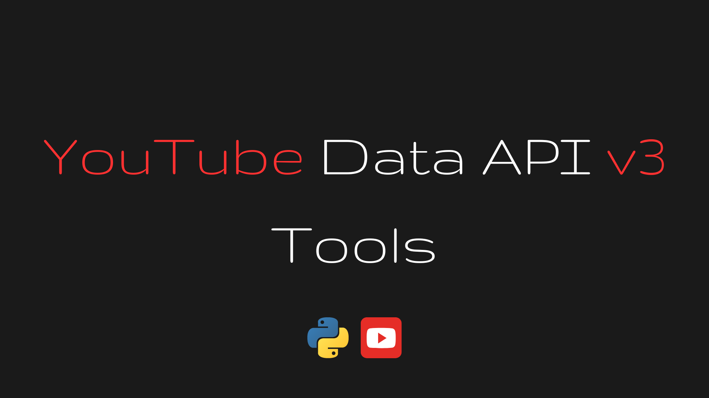

# Python3 YouTube Data API v3 Tools



> YouTube Data API v3 Tools is a concise wrapper around the YouTube API. The `YouTubeAPIv3` class contains over 150 methods to interact with YouTube. These methods cover all categories such as videos, playlists, channels, thumbnails, localization etc.
I made sure to cover all the bases.

## [Setup](#setup)
        
A `client_secret.json` file is needed in order for this class to be functional.
Or should I say ... classy ....

### [Required Python modules](#required_modules)

- google-auth
- google-auth-oauthlib
- google-auth-httplib2
- google-api-python-client
      
Keep in mind that you need to have the proper **OAuth 2.0** authentication set up and the 
permissions to manage playlists for an account. Below is a step-by-step guide on how to
obtain a ***client_secret.json*** file. 

*Please also note that the steps for setting up OAuth 2.0 authentication and using the 
client_secret.json file might change over time. For the latest and most detailed 
instructions, you should refer to the official Google API documentation for the YouTube 
API and OAuth 2.0 authentication for Python.*

1) [Google Cloud Console:](#google-cloud-console)

To use the ***YouTube API*** or any other Google API, you need to create a project on the 
**Google Cloud Console** and enable the APIs you want to use.

2) [OAuth 2.0 Credentials:](#oauth-2-credentials)
        
After creating the project and enabling the YouTube API, you need to create OAuth 2.0 
credentials. These credentials are used to identify your application and to 
authenticate and authorize access to the API. The credentials contain a client ID, 
client secret, and other information.
                
3) [Download Client Secret:](#download-client-secret)

Once you create OAuth 2.0 credentials, you can download the *client_secret.json* file 
from the Google Cloud Console. This file contains the client ID and client secret, 
which are used in the authentication process.
            
4) [Authentication Flow:](#authentication-flow)
        
When you run your Python application that interacts with the YouTube API, it will 
prompt the user to authenticate their Google account through a web browser (if necessary). 
The *client_secret.json* file is used during this authentication flow to identify your 
application and establish a secure connection.

5) [Access Tokens:](#access-tokens)

After the user grants permission to your application, the authentication server provides 
your application with an access token. This access token is used in API requests to 
prove that your application has been granted permission to access the user's resources.

6) [Protecting Client Secret:](#protecting-client-secret) 
            
The *client_secret.json* file contains sensitive information (client secret), so it should 
be kept confidential and not shared or exposed publicly. It is important to store the 
client_secret.json file securely on the server-side of your application.

When you use the Google API Client Library for Python to interact with the YouTube API, you'll 
need to set up the OAuth 2.0 authentication flow and provide the path to the client_secret.json 
file in your code to initiate the authentication process.

---

## [Usage](#usage)
> !!! NOTE: Any sensitive data used in these examples is void or not real !!!


First import the `youtube_api_tools` module.

```python
import youtube_api_tools
```

Next create a `YouTubeAPIv3` object and pass the path to your ***client_secret.json*** file
as the first argument to the constructor and optionally pass the name for the token file that 
will hold the authorization token as the 2nd argument to the constructor, and lastly your 
channel ID as the last argument to the constructor.

```python
youtube = youtube_api_tools.YouTubeAPIV3(
    "client_secret_913312345634-hsdfrlsskr1gqsedjdimjga57j84s0chml.apps.googleusercontent.com.json"
)
```

The constructor will call the `get_authenticated_service()` method which will use your 
***client_secret.json*** file to authenticate the user and will store the authorization token in 
a ***token.pickle*** file.

### Get your channel ID:

```python
channel_id = youtube.get_channel_id()
```

### Get a playlist ID:

```python
playlist_id = youtube.get_playlist_id()
```

### Get a video ID:


The rest of the documentation will be finished soon.
